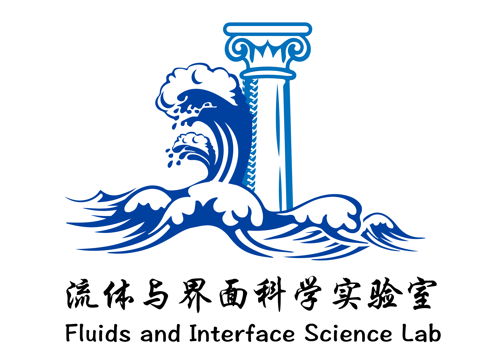
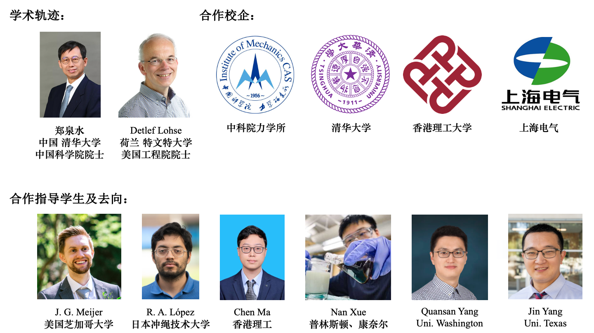

---
# Leave the homepage title empty to use the site title
title:
date: 2022-10-24
type: landing

sections:

  - block: markdown
    content:         
      # title:  流体物理与界面科学实验室
      # subtitle: 'PFIS Lab'
      text: |-
              <!-- Text with background box container -->
              

                
                <!-- Background rectangle -->
                
          <!-- Optional rounded corners -->
                

                <!-- Text content -->
                

                  "God made the bulk; surfaces were invented by the devil." &nbsp –– Wolfgang Pauli     
                  Here, we study them both.
                

              

            
    design:
      columns: '1'
      background:
        image: 
          # Name of image in `assets/media/`.
          filename: HomepageBanner.jpg
          # Apply image filters?
          filters:
            # Darken the image? Range 0-1 where 1 is transparent and 0 is opaque.
            brightness: 1
          # Use a fun parallax-like fixed background effect on desktop? true/false
          parallax: false
          # Image focal point. Options include `left`, `center` (default), or `right`.
          position: bottom
          #  Image fit. Options are `cover` (default), `contain`, or `actual` size.
          size: cover
          # Text color (true=light, false=dark, or remove for the dynamic theme color).
          text_color_light: false
      spacing:
      # Customize the section spacing. Order is top, right, bottom, left.
        padding: ['29vh', '0', '29vh', '0']
      css_class: fullscreen

  - block: markdown
    content:
      text: |-
            <!-- Horizontal container using flexbox for side-by-side layout -->
            

            <!-- Image Container -->
            

                
            

            <!-- Text Container -->
            
 
                <h2 style="font-size: 32px;           /* Heading size */
                        margin-bottom: 5px;         /* Space below heading */ 
                        text-align: center; 
                        font-family: 'Helvetica Neue';
                        color: black;            <!-- Title color -->">
                        <strong style="font-family: 'shouzhati', 'Xingkai', SimSun">流体与界面科学实验室</strong>
                </h2>
                

                        font-family: 'Chalkboard', sans-serif;">          
                  <en style="font-family: 'Hannotate SC', 'Chalkboard', sans-serif">Fluids and Interface Science (FIS) Lab</en>
                
 
              
          <!-- Inherits from parent color -->

            本实验室主要研究**流体**以及涉及**界面**的**力学**问题。包括*多相多组分流体，界面流动，固液浸润，液滴*，详情请见[研究方向](/research)。

            课题组长：[李延深](/author/李延深)，副教授、博导，入选**国家引才计划青年项目**(2021)、中科院人才计划项目、小米青年学者项目，中国科学院大学领雁金奖获得者。

            **清华大学**学士、博士。博士师从郑泉水院士，深受其创新教育理念的熏陶。荷兰特文特大学博士后，合作导师为 <em style="font-family: 'Gill Sans', times new roman">Detlef Lohse</em> 教授（荷兰、德国、美国多院院士）。  

            在 <em style="font-family: 'Chalkboard', times new roman">PNAS, PRL, JFM</em> 等**流体力学**、**物理学**领域的顶级期刊发表多篇论文，成果得到 <em style="font-family: 'Chalkboard', times new roman">Nature、Physics、Chemistry World、Europhysics News, FYFD</em> 等知名学术媒体高亮报道。详情请见[论文发表](/publication/)。
              
 
            

            
 

    design:
      background:
        color: rgb(255, 255, 255)
      spacing:
      # Customize the section spacing. Order is top, right, bottom, left.
        padding: ['100px', '0', '0px', '0px']

  - block: markdown
    content:         
      text: |-
              

                  
              

    design:
      background:
        color: rgb(255, 255, 255)
      spacing:
      # Customize the section spacing. Order is top, right, bottom, left.
        padding: ['40px', '0', '60px', '100px']

  - block: hero
    content:
      title:
      cta:
        label: 查看团队成员
        url: "./people/"
        # icon_pack: fas
        # icon: download
      # cta:
      #   label: 我看看
      #   url: "./people/"
      # Optionally, add an alternative CTA link
      cta_alt:
        label: 加入我们
        url: "./recruit/"
      subtitle:
      # text: |
      #    {}  &nbsp {}
    design:
      columns: '1'
      background:
        color: rgb(255, 255, 255)
      spacing:
      # Customize the section spacing. Order is top, right, bottom, left.
        padding: ['20px', '00px', '40px', '40%']

  - block: markdown
    content:         
      # title:  研究亮点
      # subtitle: 'FIS Lab'
      text: |-
              
              <a href="../research/">
              <h1 style="color: white;" align="center">           
                  研究亮点
              </h1>
              </a>
            
    design:
      background:
        color: '#555'
      spacing:
      # Customize the section spacing. Order is top, right, bottom, left.
        padding: ['20px', '0', '00px', '0']
    
  - block: slider
    id: highlight
    content:            
      slides:
      - title: 
        content: |-
              

                
              

        align: center
        background:
          color: '#555'
      - title: 
        content: |-
              

                
              

        align: center
        background:
          color: '#555'
      - title: 
        content: |-
                  <!-- Inline image with text flow -->
                  
                    
                  
                    <!--[见研究方向](../research/monostable)  -->

                  <!-- Inline image and text container with padding control 
                  
                    
                  
                  

                  Your text here will wrap with the image. Add more content...
                  
-->

        align: center
        background:
          color: '#555'
        # link:

        #   url: ../contact/
      
    design:
      # Slide height is automatic unless you force a specific height (e.g. '400px')
      slide_height: '70vh'
      is_fullscreen: false
      # Automatically transition through slides?
      loop: true
      # Duration of transition between slides (in ms)
      interval: 3000
---